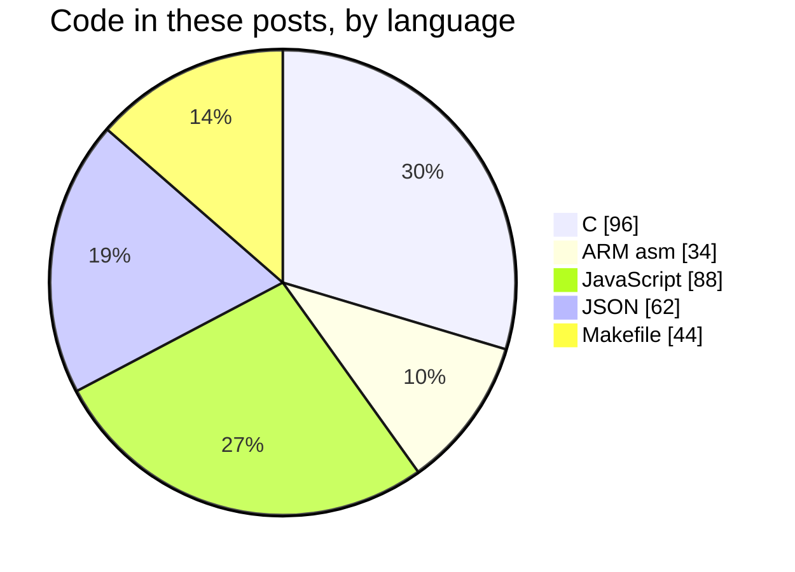

+++
title = "Two ways to draw a diagram"
date = 2026-08-22
path = "diagrams"
description = "Mermaid and Graphviz, the same diagrams side by side, on a site that makes no third-party requests."

[taxonomies]
tags = ["meta", "tooling"]

+++

Every diagram here is written as plain text. The left column is **Mermaid**,
parsed in your browser. The right is **Graphviz**, compiled to SVG before the
page was built. Same information, two engines, and the differences are the
point.

Both are self-hosted, so this page still makes no third-party requests. Mermaid
costs 3.4 MB of JavaScript and is opt-in per page --- no other post on this site
loads it. Graphviz costs nothing at runtime; it runs on my machine and ships a
static SVG.

Everything below follows the theme toggle in the header. Mermaid re-renders on
a palette change; the Graphviz SVGs are inlined rather than linked, so the same
CSS variables that colour this page colour them.

## Flowchart

The two-stage login from the OGame scraper.

```pair src=login caption="Graphviz was told to put both outcomes on one rank and to keep the dead branch out of the layout calculation. Mermaid decides for itself."
flowchart TD
    A[POST credentials] -->|valid| B[200 OK<br/>bearer token]
    A -->|invalid| C[403 Forbidden]
    B --> D[GET accounts]
```

The Graphviz source says things Mermaid has no syntax for:

``` file=diagrams/login.dot
{ rank=same; ok; bad }                   // the fork reads as a fork
post -> ok  [label="valid", weight=10];  // straighten the path that matters
post -> bad [constraint=false];          // dead end stops distorting layout
ok:e -> acct:w;                          // exact compass attach points
```

## State machine

The SWJ-DP, and the one-way door into a locked part.

```pair src=swj caption="Mermaid's stateDiagram-v2 knows what a start state is; in Graphviz it is a small filled circle you draw yourself."
stateDiagram-v2
    [*] --> JTAG: power-up
    JTAG --> SWD: 0xE79E
    SWD --> JTAG: 0xE73C
    SWD --> Locked: SWJ_CFG=100
    Locked --> SWD: BOOT0 + reset
```

## Class diagram

```pair src=services caption="Mermaid has real class semantics. Graphviz is drawing a record shape that happens to look like a class."
classDiagram
    class Service {
        +String name
        +Number port
        +start()
    }
    class UniverseService {
        +exists(name, lang)
    }
    class AccountService {
        +listForPlayer(token)
    }
    Service <|-- UniverseService
    Service <|-- AccountService
```

That `<|--` is worth a note. A shortcode that passes its body through
unescaped hands the browser a `<` followed by a pipe, and the parser has
opinions. Escaping it is what makes the class diagram survive.

## Entity relationship

```pair src=scraper-er caption="Crow's feet are built into Mermaid. Graphviz needs the cardinality written on the edge as a label."
erDiagram
    PLAYER ||--o{ ACCOUNT : owns
    ACCOUNT }o--|| UNIVERSE : "lives in"
    UNIVERSE {
        string name
        string language
        int playerCount
    }
    ACCOUNT {
        string id
        string server
    }
```

## Commit history

```pair src=rebuild caption="A git graph is a directed acyclic graph, which is the thing Graphviz was built for. This is the one where it is arguably the better fit."
gitGraph
    commit id: "jekyll"
    branch zola
    checkout zola
    commit id: "port content"
    commit id: "workshop design"
    commit id: "diagrams"
```

## Where Graphviz simply has nothing

Three of the diagram types below have no Graphviz equivalent. Not a harder
equivalent --- none. Graphviz draws graphs: nodes joined by edges. A sequence
diagram is a timeline, a gantt is a calendar, a pie is a proportion, and none
of those are graphs.

### Sequence

```mermaid caption="Mermaid only. The turnaround periods are the part that is easy to miss when reading the SWD spec."
sequenceDiagram
    participant H as Host
    participant T as Target
    H->>T: 8-bit request
    Note over H,T: turnaround
    T-->>H: 3-bit ACK
    Note over H,T: turnaround
    H->>T: 32 data bits + parity
```

### Gantt

```mermaid caption="Mermaid only. The publishing history of this site, including the silences."
gantt
    title Posts, by project
    dateFormat YYYY-MM-DD
    axisFormat %Y
    section STM32
    Setting it all up      :done, 2018-06-02, 90d
    How SWD actually works :active, 2026-08-21, 60d
    section OGame
    Initial design         :done, 2020-08-23, 40d
    Microservices          :done, 2020-09-27, 40d
    section Go
    Golang notes           :done, 2022-10-16, 60d
```

### Pie



### Bars

```mermaid caption="Mermaid only. The same numbers as the pie, with the names on the axis instead of in a legend."
xychart-beta horizontal
    title "Code in these posts, by language"
    x-axis [C, "ARM asm", JavaScript, JSON, Makefile]
    y-axis "lines" 0 --> 100
    bar [96, 34, 88, 62, 44]
```

## What the comparison actually shows

**Mermaid wins on breadth and on effort.** It has diagram types Graphviz will
never have, the source lives in the post, and there is no build step. It also
renders on GitHub, so the markdown is not inert in the repository.

**Graphviz wins on control and on weight.** `rank`, `weight`, `constraint`,
`group` and compass ports let you insist on an arrangement rather than accept
one, and the reader downloads no JavaScript at all. The cost is a separate
file per diagram and a script that has to run before the site builds.

The honest split: Mermaid for diagrams where the shape does not carry meaning,
Graphviz when it does or when the page should stay free of JavaScript. Neither
is the default; the diagram decides.
